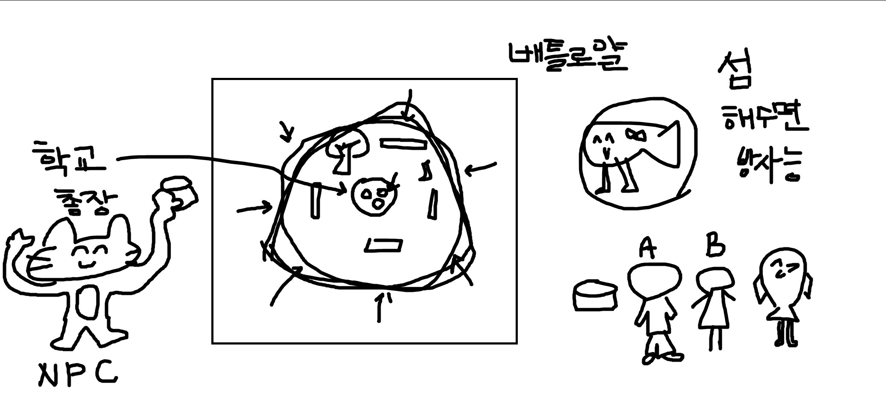

# team meeting
  
## 23/10/06 회의
  
# 1. STEEP 2024년 :
### Social
  - 저출산 고령화
  - 분초사회
  - 도파밍 사회 ( 사람들은 점점 자극적인 것을 쫓는다 )
  - 사람에 대한 완벽주의
  - 스핀오프 증가
  - 바이러스, 미생물에 대한 사람들의 관심 UP
### Tech
  - AI
  - 특히 생성형 인공지능
  - 유니티 게임 엔진 가격 논란
  - 삼성의 클라우드 기반, 모바일 게임 플랫폼 서비스 시범 운영
  - 크로스 플랫폼
### Economy
  - 디토소비 ( 나의 가치관과 취향을 반영하는 사람, 콘텐츠를 따라 선택하는 것 )
  - 개인·중소 게임개발사 대상 등급분류 수수료 50% 감면
### Echo
  - 오염수
### Polital
  - 내년 미국 대선
  - 내년 한국 국회의원 총선
  - 확률형 아이템 규제
  - 중국 판호
  - 일본의 폐수 문제
    

# 2. Fish Girl :
  +  오염수 + 해수면 상승 (환경, 정치)
  +   맵은 섬 + 학교
  +   파밍요소
  +   