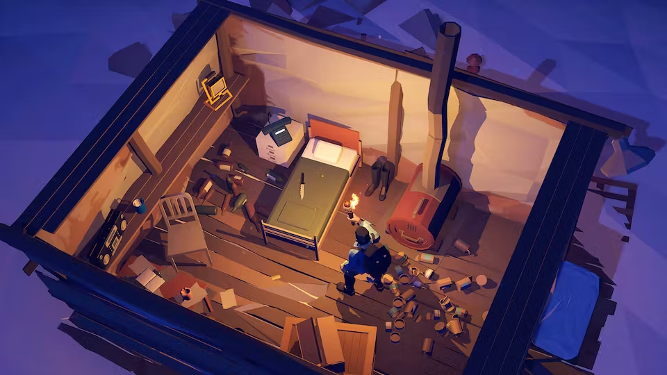
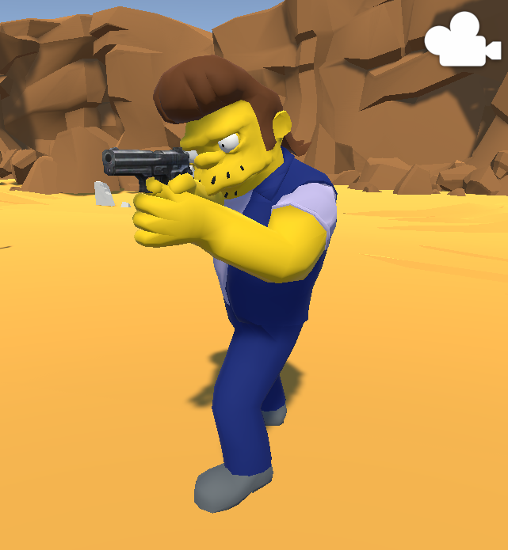
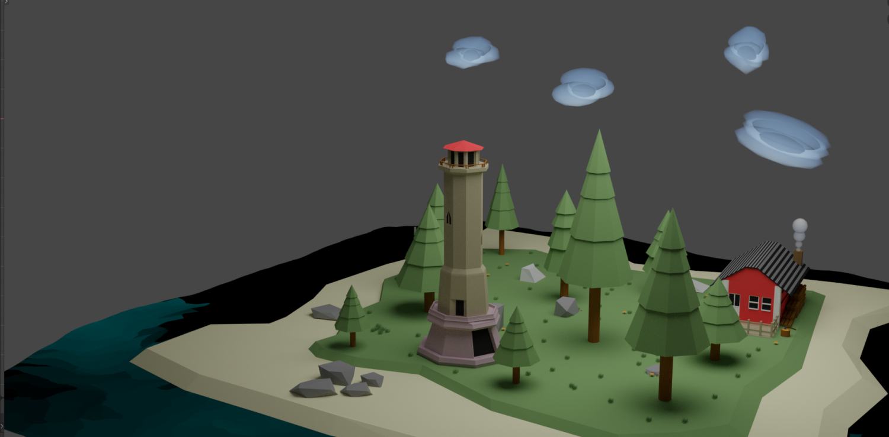
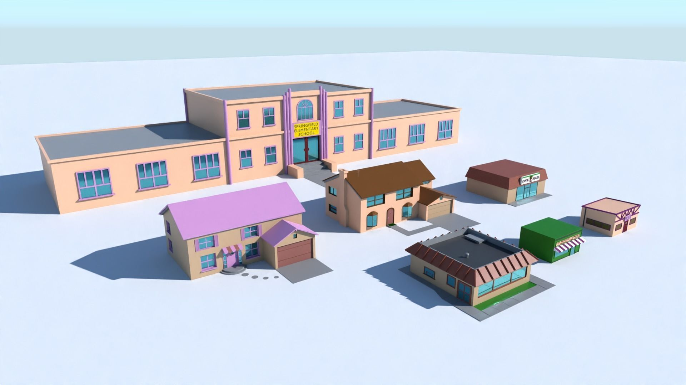
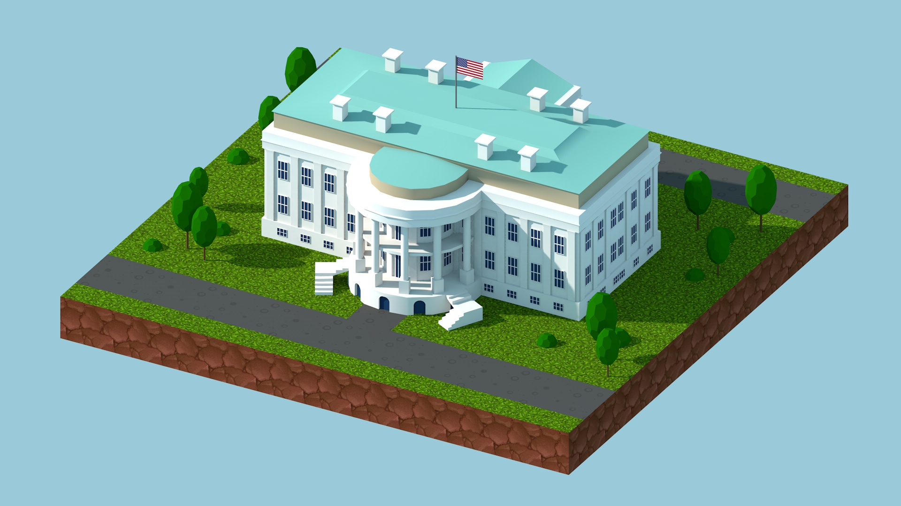
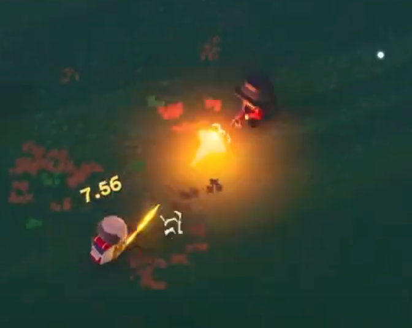
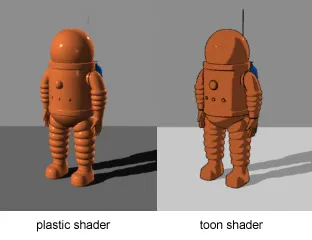

# 전체적인 컨셉: 이긴 심슨이 미국 대통령이 된다.

2024년 미국 대선 / 오염수 / 환경 이슈 반영

장르: 생존 배틀로얄 

탑뷰 카메라 

모든 플레이어는 심슨 캐릭터임.

## 진행 순서

1. 플레이어들은 각자 배를 타고 섬에 도착한다.
    
    
    
- 해변가에 바다 쓰레기를 파밍하도록 유도, 피쉬걸도 만나게 할 수 있음
1. 섬 안쪽에 스프링필드 건물들과 심슨 NPC 배치해서 바다쓰레기, 고철 교환해서 총을 준다. (미국이니까) 총, 마약, 시가
    
    
    
2. 게임시작 5분지나면 해수면 상승
3. 맵 중앙에 백악관 있음.
    
    
    

전투

총전투는 롱빈터의 조작법 따라함.

# 다음주에 뭐할까

- 제안서 문서 자세하게 작성
    - 기존의 티노 게임으로 작성한 제안서 형식 참고
- 아이디어 회의
- 타 게임 기술 요소 분석
    - 외곽선 처리
    - 툰렌더링
    
    
    
    - GI (Global Illumination)