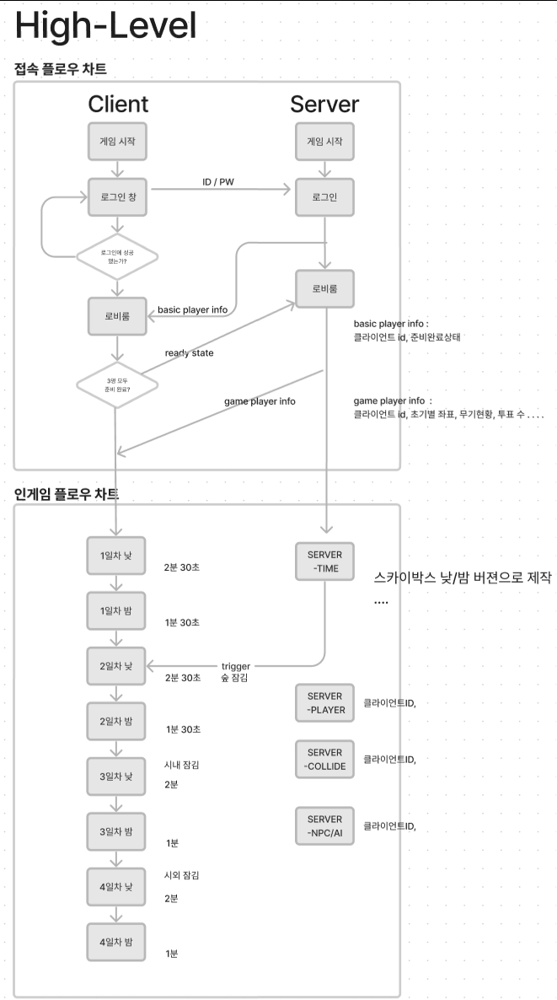

#1월 8일 회의록

### 1. 회의에서 한 일
    - High-Level 차트 제작
    - 인게임 플로우 차트 제작
### 2. 이번주에 한 일 점검
    - Base Code 제작
    - Fish Monster 모델 제작, 트럼프 모델 제작
    - Terrain 유니티에서 추출&다렉코드에서 적용
### 3. 다음 주까지 할 일
    - 황유림 : 애니메이션 상하체 분리.
    - 이시영 : 피쉬몬 어택/주금 애니메이션 , 트럼프 리깅 , 다렉공부 , 터레인 적용 문서 만들기
    - 엄미영 : 서버 기초 설계 (ID/PW), 서버 분석/공부
### 4. 다음주 회의 1월 22일 (월요일) 오후 6시