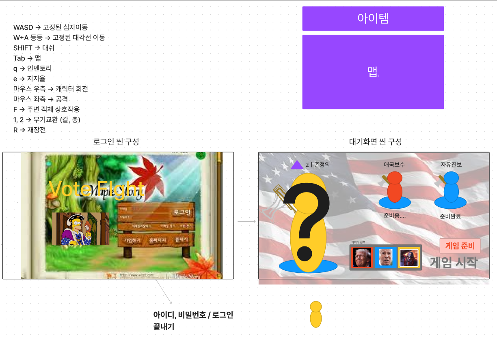

#1월 8일 회의록

### 1. 플레이어 캐릭터 고민
    - 트럼프, 바이든, 호머 심슨(임시)
    - 로그인 씬, 로비 씬 설계
### 2. 키 설정
    - Q 누르면 인벤토리
    - E 누르면 지지율
    - Tab 누르면 맵
### 3. 이번주에 한 일
    - 황유림 : 플레이어 이동 애니메이션, 마우스 우클릭으로 플레이어 시선 정하기
    - 이시영 : 터레인 적용 문서 만들기, 트럼프 리깅 중…
    - 엄미영 : 졸작 서버 분석/공부, 서버 기초 설계 해보기 (ID/PW)
### 4. 다음 주에 할 일
    - 황유림: 플레이어 상하체 분리, 플레이어 90도 회전을 애니메이션으로
    - 이시영 : 피쉬몬 어택/주금 애니메이션 , 트럼프 리깅, 바이든 모델링 , 다렉공부
    - 엄미영 : 서버 짠 것 붙이기(오류수정) . .