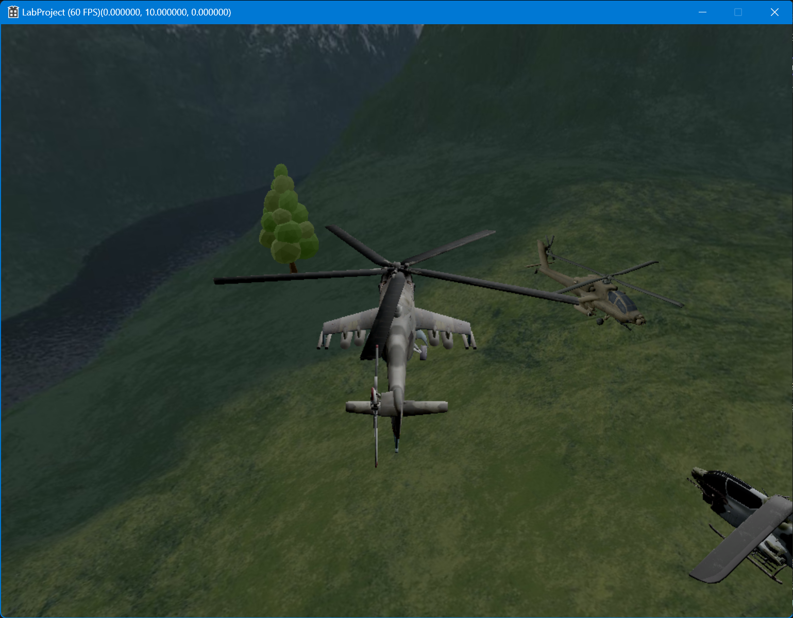

## Subject : directX 12  
#### Date : 23. 09. 26  
  

### Study
* 공부내용: 교수님이 주신 코드를 이해하고, 응용해서 새로운 모델을 불러와 보았다.
  
  
### Problem
* 발생한 문제: 
	- Mesh가 없지만 유니티에서 Mesh가 있는 것 처럼 보이는 객체들이 있었다.
	- Descriptor Heap을 생성하는 것이 잘 이해가 되지 않는다.
  
### Solve
* 해결점: 
	- Mesh가 있는 모델을 사용해야 한다.
  
  
### References
* 참고문헌  
  
  
### Appendix (Code, Test Results)
* 부록(코드나 테스트 결과 이미지 등)
